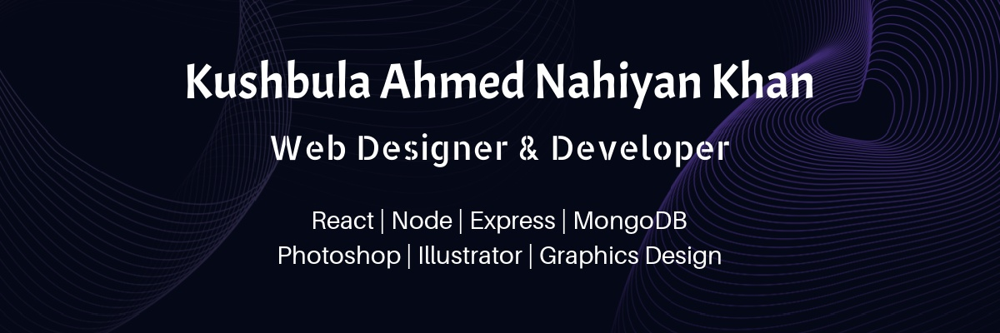

---

<h1 align="center">Hi, I'm Your Kushbula Ahmed Nahiyan Khan 👋</h1>
<h3 align="center">MERN Stack Web Developer</h3>

  Passionate about building fast, scalable, and user-friendly web applications. 
  I work with modern JavaScript technologies and love turning ideas into reality through clean, efficient code.

---

### 🔥 What I’m Currently Doing

- 🔍 **Exploring JavaScript deeply** — focusing on core concepts like closures, event loop, async patterns, prototypes, and performance optimization.
- 🌱 Learning **MERN** for building high-performance full-stack applications
- 💼 Working on a **Shipping Web Application**
- 🛠 Improving my **Backend & API development** skills
- 🎨 Learning better **UI/UX design principles**
